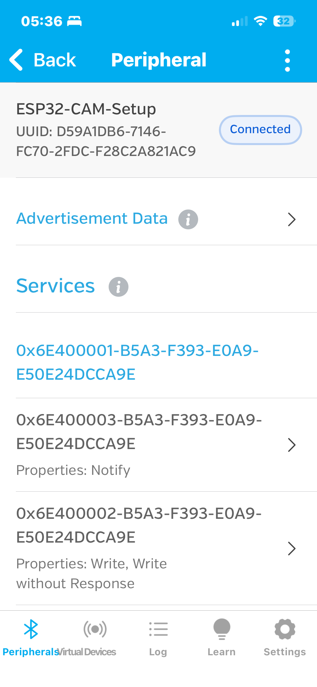
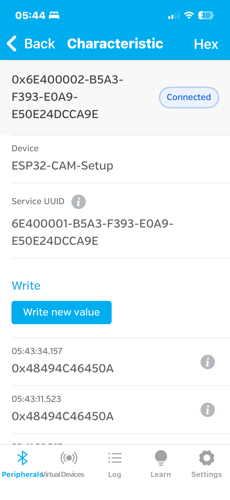
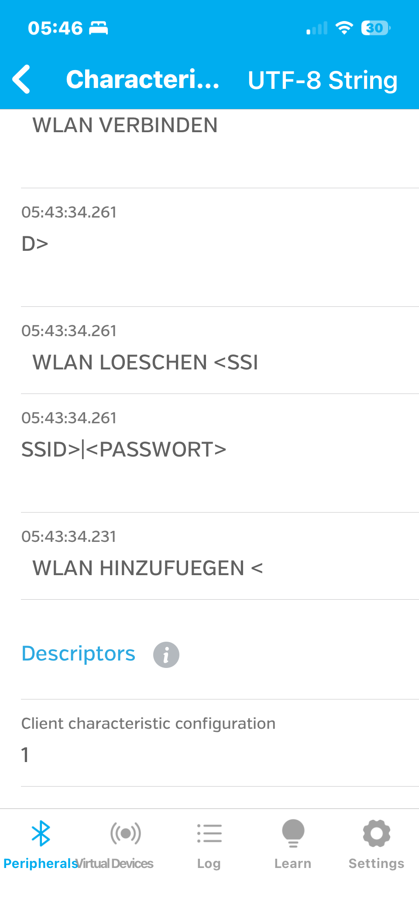
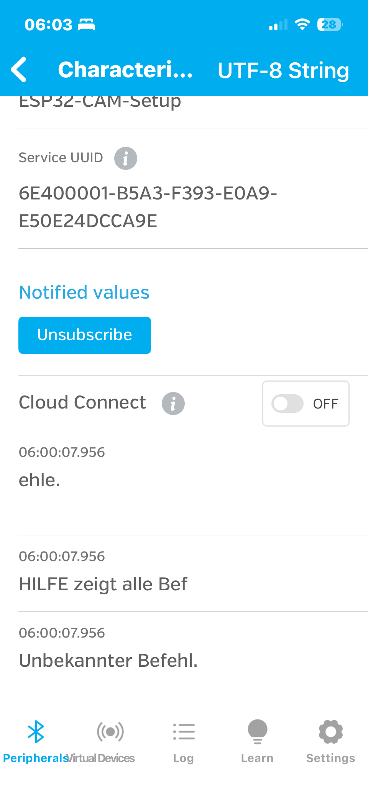

# BLE-Konfiguration mit nRF Connect

Diese Bilder dokumentieren den ersten erfolgreichen BLE-Dialog zwischen einem
iPhone und dem ESP32-CAM-Modul. Das Modul meldet sich als
`ESP32-CAM-Setup` und verwendet den Nordic-UART-Dienst.

## 1. Verbindung und BLE-Kanäle



Der Dienst besitzt zwei wichtige Kanäle:

- `6E400002-B5A3-F393-E0A9-E50E24DCCA9E`: Befehle zum ESP32-CAM senden
  (`Write` und `Write without Response`).
- `6E400003-B5A3-F393-E0A9-E50E24DCCA9E`: Antworten des ESP32-CAM empfangen
  (`Notify`).

## 2. Einen Befehl senden



Der Wert `0x48494C46450A` entspricht dem UTF-8- beziehungsweise ASCII-Text:

```text
HILFE\n
```

`0A` ist das Zeilenendezeichen. Es signalisiert dem Modul, dass der Befehl
vollständig übertragen wurde.

## 3. Antworten abonnieren



Im Notify-Kanal muss die Benachrichtigung abonniert sein. nRF Connect zeigt
die empfangenen Antworten mit Zeitstempel an. Längere Zeilen können auf mehrere
BLE-Pakete verteilt erscheinen.

## 4. Antwort des Moduls



Die drei sichtbaren Teile

```text
Unbekannter Befehl.
HILFE zeigt alle Bef
ehle.
```

zeigen, dass der Rückkanal arbeitet. Die Trennung innerhalb von `Befehle` ist
die damalige paketweise Anzeige der App und kein Übertragungsfehler.

## Ergebnis

Die Kommunikation funktionierte in beide Richtungen:

1. Das iPhone schrieb einen Befehl in den Write-Kanal.
2. Der ESP32-CAM erkannte das Zeilenende und verarbeitete den Befehl.
3. Das Modul schickte seine Antwort über den Notify-Kanal zurück.

Für die tägliche WLAN-Konfiguration übernimmt inzwischen das Windows-Programm
im Ordner `WindowsBLEDialog` diese Schritte einschließlich des automatischen
Zeilenendes und des Zusammensetzens aufgeteilter Antworten.
